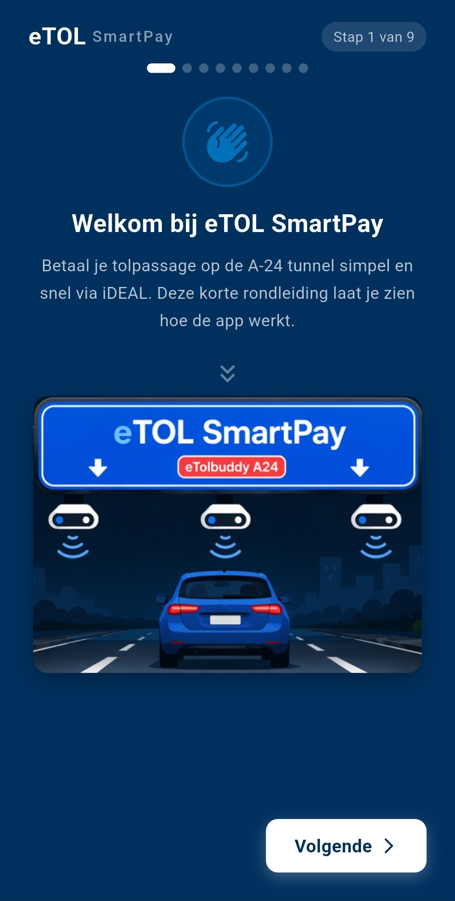
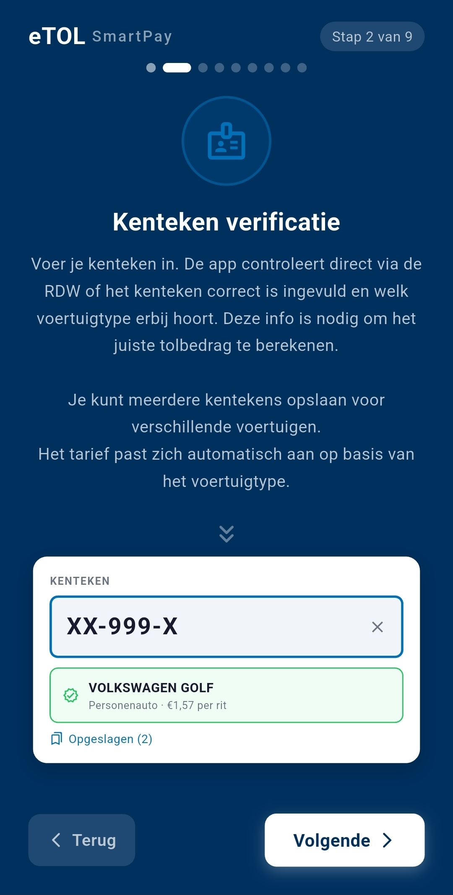
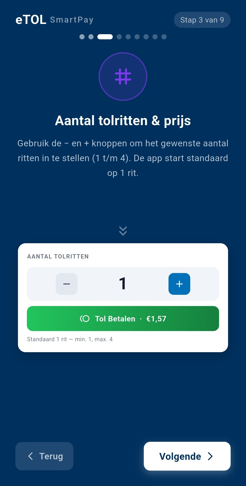
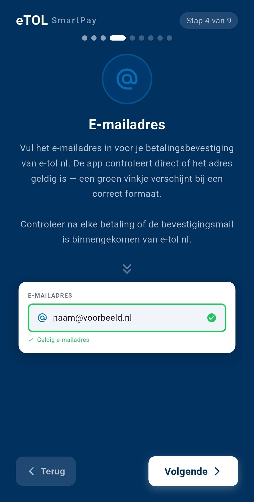
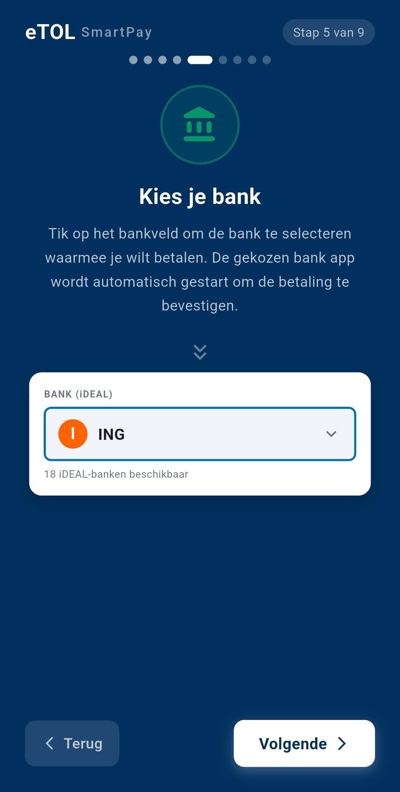
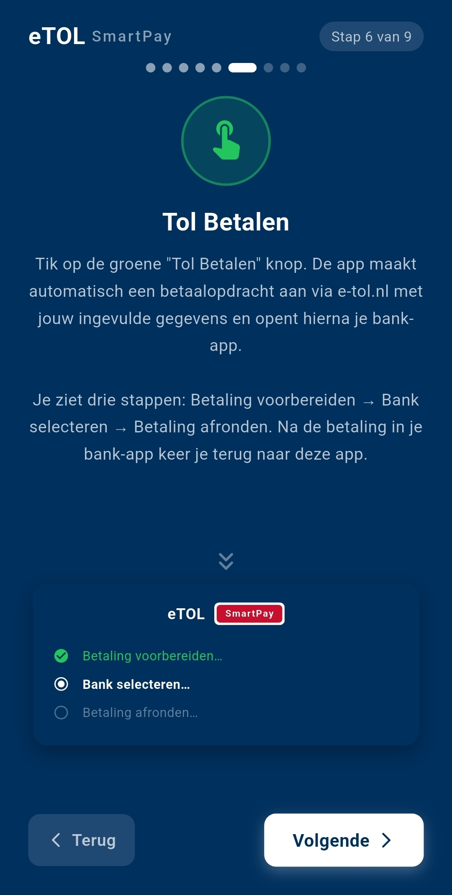

## eTOL SmartPay

**eTOL SmartPay** is een gebruiksvriendelijke betaalassistent die het invoeren en verwerken van tolbetalingen via de officiële e‑TOL omgeving versnelt en vereenvoudigt.

De app begeleidt gebruikers automatisch stap voor stap bij het invoeren van gegevens, zoals kenteken (RDW geverifieerd), e‑mail en het aantal ritten. Vervolgens wordt de gebruiker automatisch doorgestuurd naar de officiële e‑TOL betaalomgeving om de betaling via de eigen bank (**iDEAL**) af te ronden.

De betalingstransactie vindt plaats via de officiële e‑TOL en bankomgeving. **eTOL SmartPay bewaart geen bank-inloggegevens**. Kentekens, voorkeuren, betaalstatus en passagegeschiedenis worden lokaal bewaard. De Android-app is beschikbaar via Google Play; de iPhone-versie is in ontwikkeling, zonder vastgestelde releasedatum.
<p align="center">
  
  
  
</p>
## Functionaliteiten
- 🚗 **Opslaan van meerdere kentekens**  
  Na het afronden van een tolbetaling worden gebruikte kentekens automatisch opgeslagen. Hierdoor bouw je eenvoudig een overzicht op van je voertuigen en kun je bij een volgende betaling snel wisselen tussen kentekens binnen je wagenpark.

- 📧 **Herbruikbaar e-mailadres**  
  Het ingevoerde e-mailadres wordt onthouden, zodat dit niet telkens opnieuw ingevoerd hoeft te worden.
<p align="center">
  
  
  
</p>

- 📊 **Tolsessie geschiedenis**  
  Inzicht in eerder uitgevoerde tolsessies voor overzicht en controle.

- 🧭 **Eerste keer starten wizard**  
  Een begeleid onboardingproces bij de eerste keer opstarten van de app.
## Belangrijk
- ✅ **Android beschikbaar; iPhone-versie in ontwikkeling**
- 🔒 **Lokale geschiedenis; geen bank-inloggegevens**
- 🌐 **Betaling verloopt volledig via officiële e‑TOL en bankomgeving**

## Disclaimer
Deze applicatie is een **onofficiële betaalassistent** en staat los van de officiële e‑TOL organisatie.

Het gebruik van eTOL SmartPay is volledig op eigen risico. Hoewel de app is ontworpen om het betaalproces te vereenvoudigen en te ondersteunen, kan er geen garantie worden gegeven op de juistheid, beschikbaarheid of werking van de dienst.

De ontwikkelaar is op geen enkele wijze aansprakelijk voor:
- foutieve invoer van gegevens  
- gemiste betalingen of boetes  
- storingen in de e‑TOL website of betaalomgeving  
- directe of indirecte schade voortvloeiend uit het gebruik van deze applicatie  

Door gebruik te maken van deze app accepteer je deze voorwaarden.

## Privacy & Gegevensverwerking

eTOL SmartPay respecteert de privacy van gebruikers en verwerkt zo min mogelijk gegevens.

- 📱 Gegevens zoals kentekens en e-mailadres worden **alleen lokaal op het apparaat opgeslagen**
- ☁️ De app heeft geen cloudaccount; voertuigcontrole en betalingen gebruiken RDW, e-TOL en bankdiensten
- 🔐 Betaal- en passagegeschiedenis worden lokaal bewaard; bank-inloggegevens niet
- 🌍 Alle betalingen verlopen via de officiële e‑TOL website en de beveiligde omgeving van de bank

De app heeft geen toegang tot gevoelige persoonsgegevens buiten wat strikt noodzakelijk is voor het functioneren van de applicatie.

## Website en contactformulier

Dit is een statische GitHub Pages-website, zonder buildstap. Open `index.html` lokaal om de pagina's te bekijken. Gedeelde navigatie en formulierbediening staan in `site.js` en `styles.css`.

- `sponsors.html` biedt informatie over bijdragen en zakelijke sponsoring. Er is nog geen donatielink; publiceer geen lege of fictieve betaalknop.
- Het contactformulier verstuurt een gewone HTML POST naar `https://formspree.io/f/myekynyw`. De beveiligde Formspree-pagina verzorgt CAPTCHA en bevestiging. Dit is bewust gekozen in plaats van Ajax, omdat geen eigen reCAPTCHA-sitekey is ingesteld.
- Het ontvangstadres wordt uitsluitend in Formspree geconfigureerd, niet in publiek HTML of JavaScript.
- Controleer in het Formspree-dashboard dat de ontvanger bevestigd is en CAPTCHA en het spamfilter ingeschakeld zijn. Het verborgen `_gotcha`-veld is extra bescherming, geen vervanging voor servercontrole.
- Controleer beschikbare inzendlimieten en eventuele domeinrestricties in het gekozen Formspree-abonnement. Zet CAPTCHA niet uit om een fout bij verzending te omzeilen.
- Test vóór publicatie vanaf de echte website of de beveiligde verzendpagina werkt en één afgesproken testbericht aankomt. Verifieer ook fouten en terugkeer naar het formulier. Geen volledige spamvrijheid kan worden gegarandeerd.
- Websitecontact wordt ook in de Formspree-inbox verwerkt en opgeslagen. De privacytekst maakt onderscheid tussen deze berichten en de lokale appgeschiedenis.
- De sponsorroute gebruikt expliciet `sponsors.html`, zodat ook directe links op GitHub Pages werken zonder speciale rewrite-configuratie.

De functiepoll onder **In ontwikkeling** biedt drie ideeën: geplande-ritherinneringen, een tolkostenbudget en zakelijk/privé-labels. Dit zijn voorstellen, geen toegezegde functies. Stemmen gaan naar Supabase, niet naar Formspree. Er is geen openbare totaalteller of gegarandeerde één-stem-per-persoon-controle. Alleen het sponsorformulier gebruikt `data-formspree-form`.

## Supabase-poll instellen

De websitekoppeling is voorbereid voor `https://pqblykfmvmqmsmqsfsld.supabase.co`. De publishable key in `site.js` is publiek; plaats daar nooit geheime sleutels. Totdat de Turnstile-sitekey is ingevuld blijft stemmen uitgeschakeld.

1. Open de Supabase SQL Editor en voer `supabase/migrations/20261005_feature_poll.sql` één keer uit. RLS staat aan en er zijn geen publieke lees- of schrijfpolicies. Alleen de serverfunctie schrijft stemmen.
2. Maak in Cloudflare Turnstile een widget voor `etol-smartpay.nl` en `www.etol-smartpay.nl` (Managed). Vul de publieke sitekey in bij `turnstileSiteKey` in `site.js`. Gebruik geen testsleutels op de echte website.
3. Zet de geheime Turnstile-key in Supabase bij Edge Functions → Secrets als `TURNSTILE_SECRET_KEY`. Deel deze niet in chat of git. `SUPABASE_URL` en `SUPABASE_SERVICE_ROLE_KEY` zijn de standaard serveromgevingsvariabelen; ze blijven uitsluitend op de server.
4. Maak een Edge Function met exact de naam `feature-poll`, gebruik `supabase/functions/feature-poll/index.ts` en deploy. Zet **Verify JWT** uit voor deze functie: publishable keys zijn geen legacy JWT. De functie controleert in plaats daarvan elke stem met Turnstile, inclusief hostname en action. CLI-deploy gebruikt de instelling in `supabase/config.toml`.
5. Publiceer de website en controleer met één afgesproken teststem of één rij verschijnt in `feature_poll_votes`. Test ook afwijzing van ongeldige keuzes, CAPTCHA-fouten en directe publieke databaseverzoeken. Er is nog geen echte stem verzonden vanuit deze ontwikkelsessie.

De Edge Function accepteert alleen de twee hierboven genoemde productie-origins; lokale `file:`-pagina's kunnen niet echt stemmen. UI-tests mogen aanvragen onderscheppen maar mogen de productiebeveiliging niet omzeilen. Elke inzending bevat een willekeurige UUID; herhalen van dezelfde inzending gebruikt dezelfde UUID zodat de database geen dubbele rij opslaat. Bij een fout blijft de keuze behouden en moet Turnstile opnieuw valideren. Geen namen, e-mails of IP-adressen worden in de stemtabel opgeslagen. Technische providerlogs kunnen wel bestaan.

Bekijk aantallen in de SQL Editor:

```sql
select choice, count(*) as votes
from public.feature_poll_votes
group by choice
order by votes desc;
```

Controleer de actuele Supabase- en Turnstile-limieten en eventuele pauzering van inactieve gratis projecten. De frontend toont pas een bevestiging na succesvolle serveropslag; fouten vallen niet terug op Formspree.

Betaal binnen 3 dagen na een passage. Optionele herinneringen volgen na 24, 48 en 68 uur; het laatste moment is 4 uur vóór de betaaltermijn. Detectie en bezorging van meldingen blijven afhankelijk van toestelinstellingen en ontvangst.

Het blok **In ontwikkeling** op de homepage houdt toekomstige functies apart van de beschikbare Android-functionaliteit. Vooruitbetalen is in testfase, geen afgeronde functie. De iPhone-versie is in ontwikkeling, nog niet beschikbaar in de App Store. Presenteer deze onderdelen niet als reeds beschikbare functies in metadata of de FAQ.
